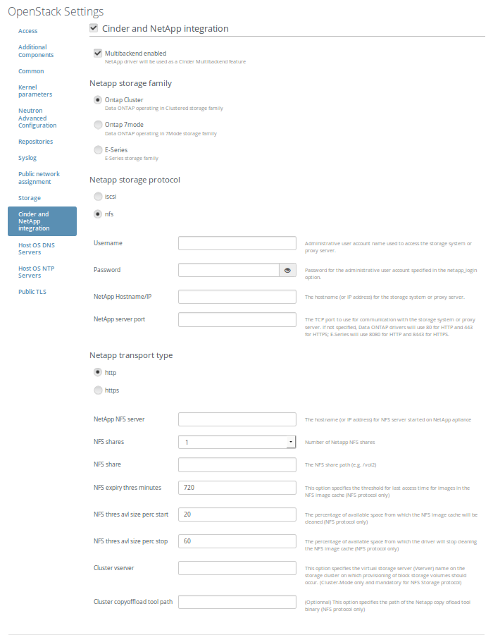
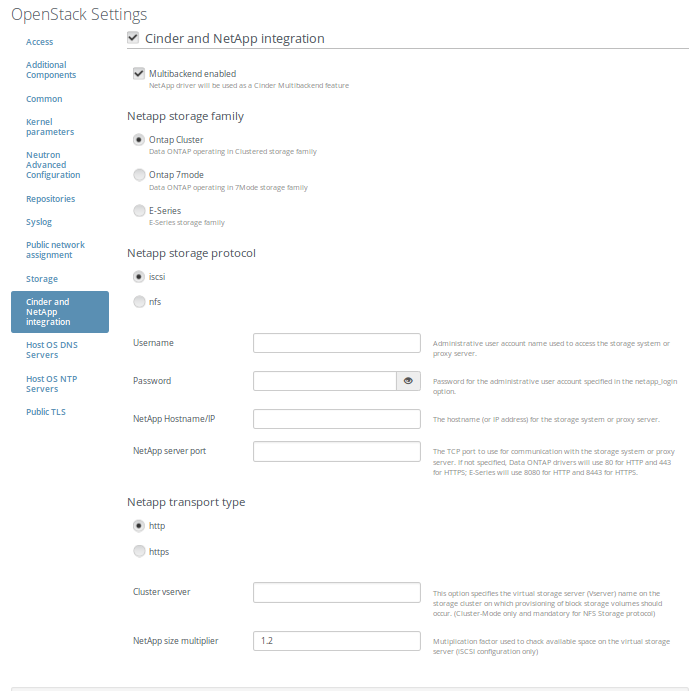
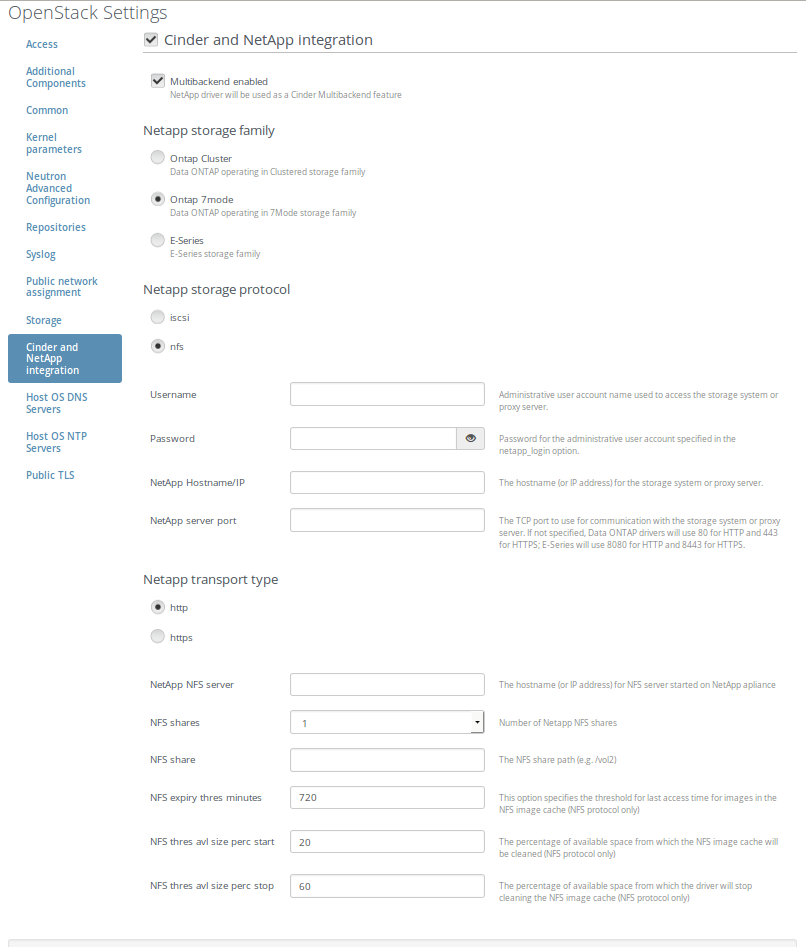
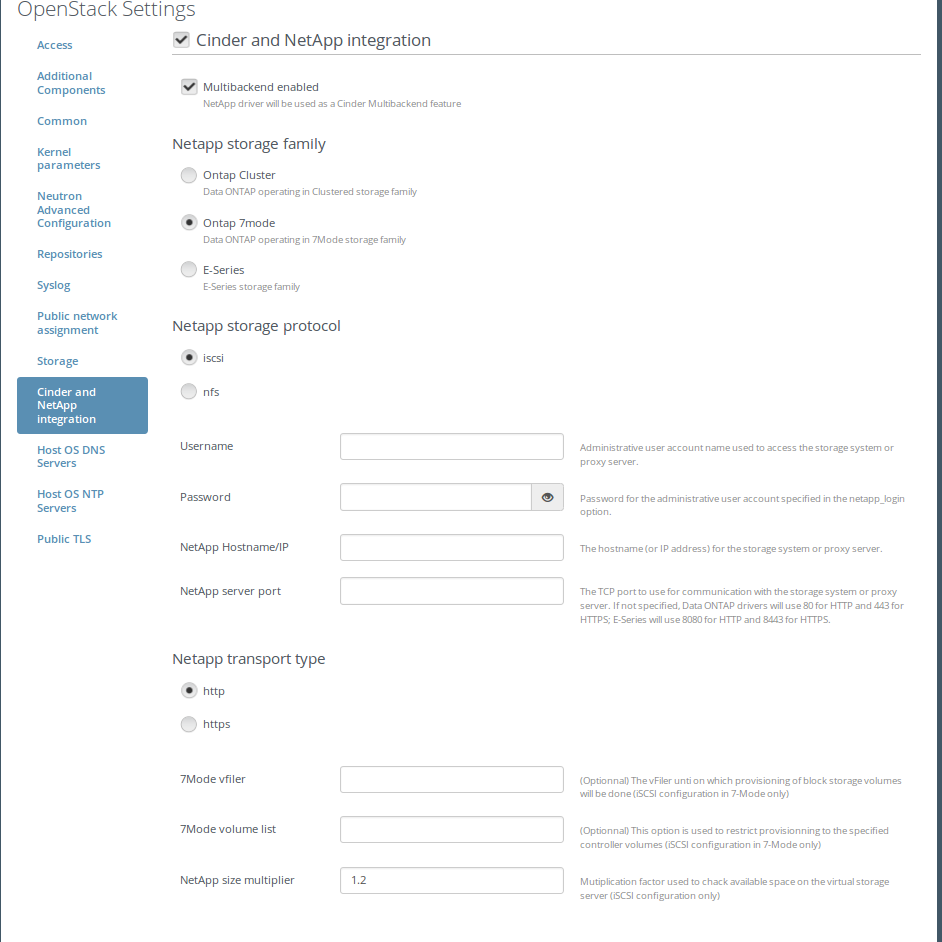

Cinder NetApp plugin for Fuel
=============================

cinder-netapp plugin
--------------------

Overview
--------

NetApp plugin can replace the Cinder LVM backend by Cinder Netapp Backend or work in parallel when deployed with multi-backend enabled.
LVM is the default volume backend that uses local volumes managed by LVM.

The plugin support following storage familly mode:
 - 7 Mode
 - Cluster Mode

This repo contains all necessary files to build Cinder NetApp Fuel plugin.

Requirements
------------

| Requirement                                                                              | Version/Comment                                         |
|------------------------------------------------------------------------------------------|---------------------------------------------------------|
| Mirantis Openstack compatibility                                                         | 7.0                                                     |
| Netapp filer or appliance  is reacheble via one of the Mirantis OPenstack networks       | Cluster mode or 7 mode storage familly with nfs4 enabled|

Recommendations
---------------

None.

Limitations
-----------

Since only one netapp backend can be setup, Cinder node will shared the same backend

Installation Guide
==================

CMODE appliance
---------------

Pre setup
~~~~~~~~~
1. Using VMware ESX or VMware player, create 2 networks called VM Network and Cluster Network.

2. Untar the vsim and add it to your VMware ESX inventory/VMware Player inventory.

NOTE: The VM will have 4 NICs. The first 2 e0a and e0b are connected to Cluster  
Network and the second 2 (e0c and e0d) are connected to the VM Network. The VM  
Network   should   be   the   regular   VMware   vSwitch   that   is   bridged   onto   the   lab   network.  
The Cluster Network is a vSwitch that's connected to nothing. The purpose of the  
Cluster Network is the following: when you have multiple vsims you want to cluster  
together, they use this private network to talk to each other. The point is not in  
clustering vsims (this will not be done), so this network will be unused, but you should  
still create it. You should only take into consideration that e0a and e0b are connected to  
a fake network so you should not use them; use e0c and e0d exclusively.  
OS setup

OS setup
~~~~~~~~
1. Start up the VM with the console open. 
2. Press Ctrl­C when the message about the boot menu appears (you only get about 15 seconds to do this so do not miss it). 
3. Select option 4 (Clean configuration and initialize all disks). 
4. Answer Yes to the next 2 questions. 
5. The VM will reboot and do some work. 

Cluster setup
~~~~~~~~~~~~~

1. When it asks if you want to join or create a cluster, select Create. 
2. Answer Yes when it asks about a single node cluster. 
3. Enter the cluster name: <cluster_name>­cluster. 
4. Enter cluster base license key. Do not enter any more license keys. 
5. Enter the admin password twice. 
6. Cluster management interface. 
 
Port: e0c

IP address: 192.168.4.10

Netmask: 255.255.255.128

Default gateway 192.168.4.1

DNS domain name: <name>.netapp.com

Nameserver IP: 192.18.4.1

Location: <location_name>

7. Node management interface. 
 
Port: e0c

IP address: 192.168.4.12

Netmask: 255.255.255.128

Default gateway 192.168.4.1

8. Press enter to acknowledge the autosupport notification 

Cluster configuration
~~~~~~~~~~~~~~~~~~~~~

1. You can either continue through the VMware console, or switch to SSH at this point. If you SSH, connect to the cluster management interface (in our case, that is 192.168.4.10).

2. Login at the prompt using <admin_name> and <password>.

3. Add the unassigned disks to the node by entering the following command: storage disk assign -all true -node <cluster_name>-cluster-01

4. Create an aggregate using 10 disks: storage aggregate create -aggregate aggr1 -diskcount 10

5. Create a vserver:

  ``vserver create -vserver <server_name>-vserver -rootvolume vol1 -aggregate aggr1 -ns-switch file -rootvolume-security-style unix``
 
6. Create a data LIF:

  ``network interface create -vserver bswartz-vserver -lif bswartz-data -role data -home-node <cluster_name>-cluster-01 -home-port e0d -address <192.168.4.15>-netmask <255.255.255.128>``

7. Add a rule to the default export policy:

  ``vserver export-policy rule create -vserver <server_name>-vserver -policyname default -clientmatch 0.0.0.0/0 -rorule any -rwrule any -superuser any -anon 0``

8. Enable NFS on the vServer:
 
  ``vserver nfs create -vserver <server_name>-vserver -access true``
 
9. Create a volume with some free space:

  ``volume create -vserver <server_name>-vserver -volume vol<volume_number> -aggregate aggr1 -size 5g -junction-path /vol<volume_number>``

7Mode appliance
---------------

Pre setup
~~~~~~~~~
1. Using VMware ESX or VMware player, create 2 networks called VM Network and Cluster Network.

2. Untar the vsim and add it to your VMware ESX inventory/VMware Player inventory.

NOTE: The VM will have 4 NICs. The first 2 (e0a and e0b) are connected to Cluster 
Network and the second 2 (e0c and e0d) are connected to the VM Network. The VM 
Network should be the regular VMware vSwitch that is bridged onto the lab network.  
The Cluster Network is a vSwitch that's connected to nothing. The purpose of the 
Cluster Network is the following: when you have multiple vsims you want to cluster  
together, they use this private network to talk to each other. The point is not in 
clustering vsims (this will not be done), so this network will be unused, but you should  
still create it. You should only take into consideration that e0a and e0b are connected to 
a fake network so you should not use them; use e0c and e0d exclusively.  
OS setup

OS setup
~~~~~~~~
1. Start up the VM with the console open.

2. Press Ctrl­C when the message about the boot menu appears (you only get about ­15 seconds to do this so do not miss it).

3. Select option 4 (Clean configuration and initialize all disks).

4. Answer Yes to the next 2 questions.

5. The VM will reboot and do some work.

7Mode setup
~~~~~~~~~~~

1. enter the hostname.

2. when ask to enable ipv6 select no.

3. when ask to configure interface groups select no.

4. configure the 4 nic.

IP address: 192.168.4.10

Netmask: 255.255.255.128

5. configure the default gateway ipv4.

6. When ask to enter the name or ip address of the administration host, leave empty and press enter.

7. select your time zonetime zone.

8. enter the root directory for HTTP files [ /home/http]

9. when ask if you you want to run DNS resolver, NIS Client or configure SAS shelves answer no.

10. configure password for admin user.

Storage configuration
~~~~~~~~~~~~~~~~~~~~~
1. You can either continue through the VMware console, or switch to SSH at this point. If you SSH, connect to the cluster management interface (in our case, that is <192.168.4.10>).

2. Login at the prompt using <admin_name> and <password>. 

3. Add the unassigned disks to the node:

  ``disk assign all``

4. Create an aggregate using 10 disks:

  ``aggr create aggr<aggregate_number> 10``

5. Create a volume with some free space:

  ``vol create vol<volume_number>  aggr<aggregate_number> 5g``

6. add license for nfs :

  ``license add <xxx>``

7. enable nfs:

  ``nfs on setup``

8. Unexport the volume (which gets automatically exported):

   ``exportfs -z /vol/vol<volume_number>``

9. export /vol/vol<volume_number> for NFS readwrite and roor access for server on the Mirantis openstack network:

   ``exportfs -p rw=<192.168.168.0/24>,root=<192.168.168.0/24>,rw=<10.194.167.0/24>,root=<10.194.167.0/24> /vol/vol1``

10. enable httpd (needed to manage your appliance using the OnCommand System Manager):

   ``options httpd.admin.enable true``
   ``options httpd.admin.ssl.enable true``

cinder-netapp plugin installation
---------------------------------

1. Clone the fuel-plugin repo from: https://github.com/stackforge/fuel-plugin-cinder-netapp.git

   ``git clone``

2. Install the Fuel Plugin Builder:

   ``pip install fuel-plugin-builder``

3. Build nova-nfs Fuel plugin:

   ``fpb --build fuel-plugin-cinder-netapp/``

4. The cinder_netapp-<x.x.x>.rpm file will be created in the plugin folder (fuel-plugin-cinder-netapp)

5. Move this file to the Fuel Master node with secure copy (scp):

   ``scp cinder_netapp-<x.x.x>.rpm root@:<the_Fuel_Master_node_IP address>:/tmp``

   ``cd /tmp``

6. Install the cinder_netapp plugin:

   ``fuel plugins --install cinder_netapp-<x.x.x>.rpm``

7. Verify that the plugin is installed correctly:

   ``fuel plugins --list``

8. Plugin is ready to use and can be enabled on the Settings tab of the Fuel web UI.

User Guide
==========

Cinder-netapp plugin configuration
----------------------------------
1) Enable the plug-in on the settings tab of the Fuel web UI
2) Enter Netapp Credentails int the Cinder and Netapp integration. NetApp parameters vary depending the storage familly mode and storage protocole selected

   a) Cluster Mode and nfs

Here is a screenshot of the fields

   b) Cluster Mode and iscsi

Here is a screenshot of the fields

   c) 7 Mode and nfs

Here is a screenshot of the fields

   d) 7 Mode and iscsi

Here is a screenshot of the fields

3) Assign Cinder role to one of the nodes
4) For more information on NetApp integration into Cinder, configuration and API issues, see  [the Official Netapp Guide for Openstack](http://docs.openstack.org/juno/config-reference/content/netapp-volume-driver.html).

Deployment details
------------------

Create nfs_share config file
Edit cinder config file to use netapp common driver
Restart cinder services

Known issues
------------

None.

Release Notes
-------------

**3.1.0**

* add high availability of operations with Volumes

**3.0.0**

* migrate the plugin from 2.0.0 to 3.0.0 package version

**2.0.0**

* migrate plugins from 1.0.0 to 2.0.0 package version

**1.2.0**

* add  multi backend support

* add missing dependencies on compute node

* add capacity to deploy cinder role on a non controller node

**1.1.0**

* add 7 mode storage familly support

**1.0.0**

* Initial release of the plugin

